# Tugas 1 Big Data 

- [Tugas 1 Big Data](#tugas-1-big-data)
  - [Business Understanding](#business-understanding)
  - [Data Understanding](#data-understanding)
  - [Data Preparation](#data-preparation)
  - [Modeling](#modeling)
  - [Evaluation](#evaluation)
  - [Deployment](#deployment)

## Business Understanding

Data can be manipulated to see :  
- Majority of interest between the three candidates
- Interest for the three candidates in every city
- Interest for the three candidates at any given time  

These are, of course restricted by the data scope.

## Data Understanding

Data contains the Google search trend for the three 2015 UK Election candidates. All of the trends listed are restricted to only the United Kingdom. The data were recorded in every minute for each respective cities. All of the data were recorded in 30th of April 2015. There are in total 14578 rows and 8 columns.

These 8 columns are:

- **city**  : City where the trend was happening
- **region**   : Region of United Kingdom in which the city was situated
- **country** : The country, which is fixed to United Kingdom in this dataset
- **Date**  : Date when the trend was happening, fixed to 30th of April 2015
- **Time in GMT** : The time when the trend was happening. Recorded every minute.
- **DavidCameron** : The trend for this candidate
- **EdMilliband** : The trend for this candidate
- **NickClegg** : The trend for this candidate

## Data Preparation

1. Using Knime's **File Reader** Node, open and extract the CSV file to allow further manipulation.
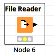  
.png)

2. Transfer the extracted data into a **Column Splitter** Node to split the columns  
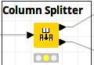  
3. Set how will the data be split and execute.
.png)
4. Send a part of the split data to a **CSV Writer** node to be written into a .csv file  
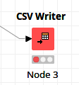
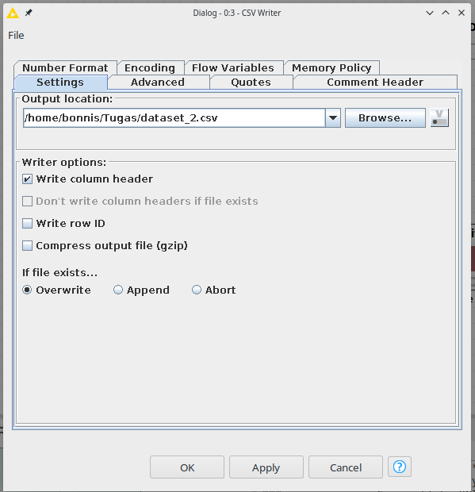
5. To send the remaining part of the data to a database, a connection to the database is needed. So connect to the database using the relevant DB node (In this assignment, MariaDB server was used, So **MySQL Connector** node was used)  
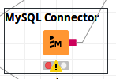
6. Fill the needed fields accordingly and execute
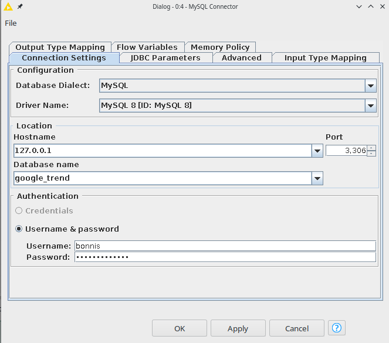
7. Transfer the remaining data and connect the DB connection onto a **DB Writer** node  
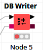
8. Set the schema and table where the data will be inserted into
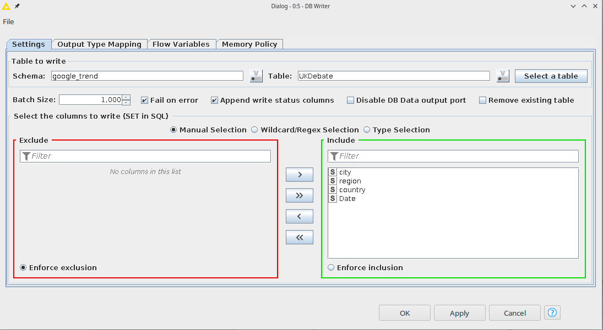
9. Execute the remaining nodes  
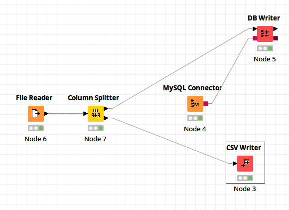
## Modeling

1. Using Knime's **File Reader** Node, open and extract the CSV file to allow further manipulation.
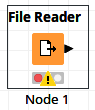
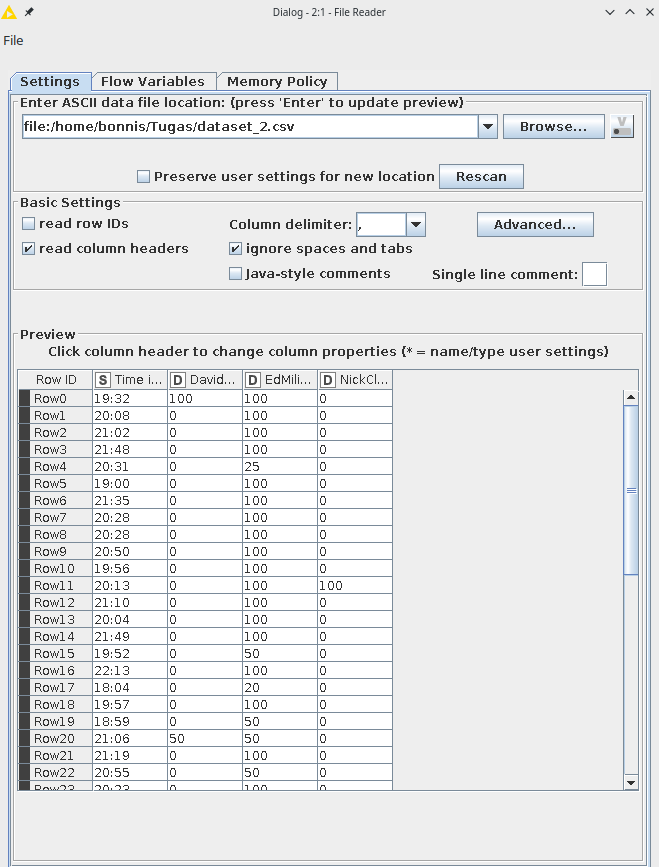
2. Connect to the database using **MySQL Connector** Node (this specific node was used because a MariaDB server was used)  
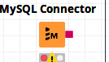
3. Fill the credentials accordingly and execute
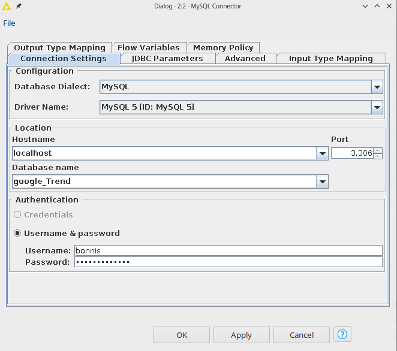
4. To actually fetch the data from the Database, use **DB Query Reader** Node  
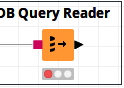
5. Write the query to fetch all the rows and columns from the table and execute.
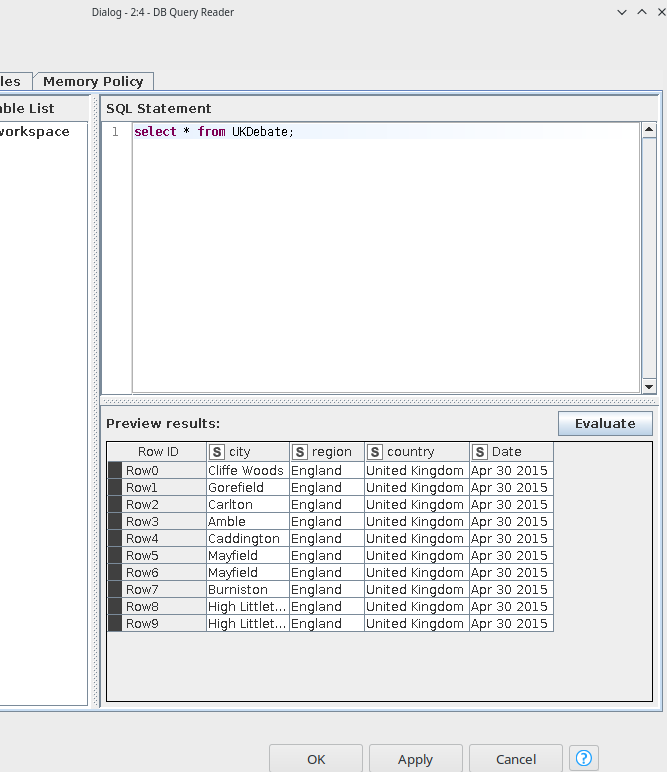
6. Transfer both of the extracted data into **Column Appender** Node and execute it to append the data.  
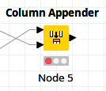

## Evaluation

The **Column Appender** Node successfully appended the split table into the original table before the split.

## Deployment

1. Transfer the appended table onto a **DB Writer** Node and connect the previous **MySQL Connector** Node to it.  
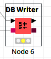
2. Set the schema and the table where the data will be inserted into
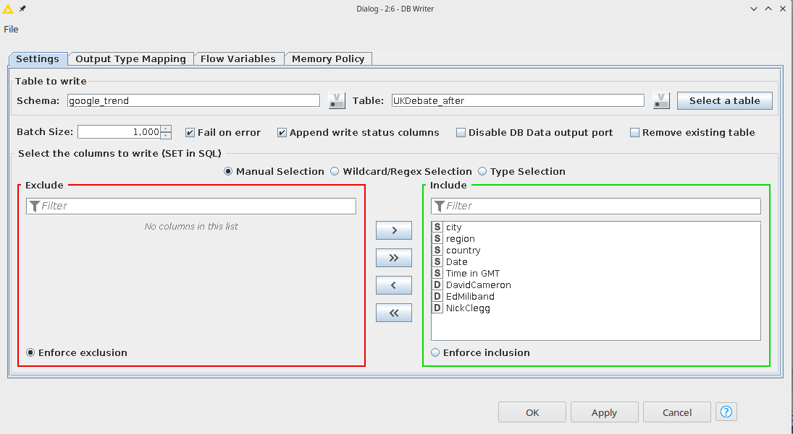
3.  Transfer the appended table onto a **CSV Writer** Node and set the output.  
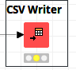  
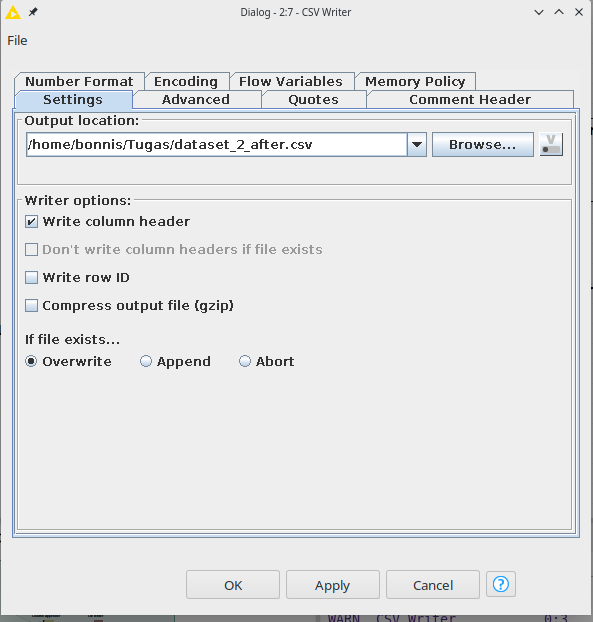
4. Execute the remaining nodes
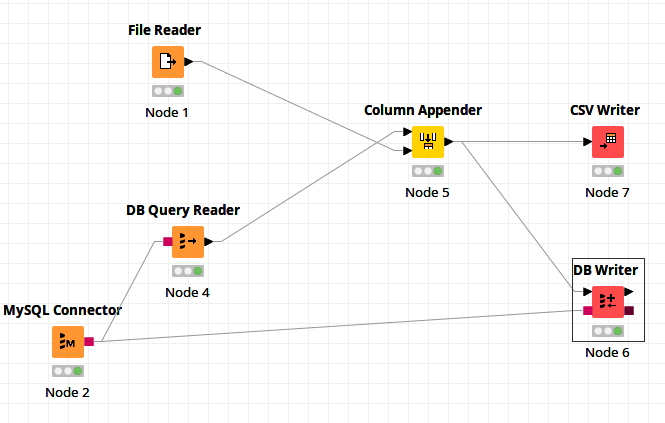